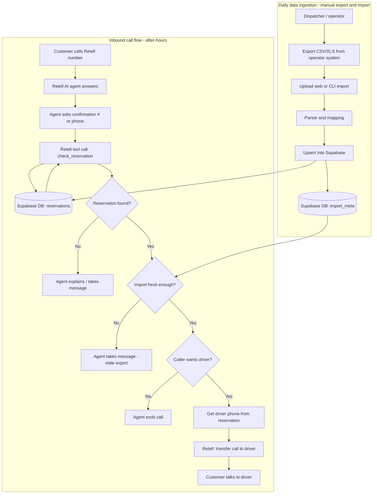

# Voice Agent Integration Plan: After-Hours & Call Routing

Plan for the voice agent used when the office is closed: confirm active arrivals and route calls to the assigned driver so the customer can confirm pickup.

---

## 1. Retell AI: Call Routing & Transfer

**Yes — Retell supports routing and transferring calls.**

| Capability | Details |
|------------|--------|
| **Transfer to phone number** | Agent can transfer the call to an external number (e.g. driver’s cell). |
| **Implementation** | **Prompt-based agents:** use the *Transfer call* function in Step 3 (Functions). **Flow-based agents:** use the *Call Transfer Node* in the conversation flow. |
| **Docs** | [Transfer call](https://docs.retellai.com/build/single-multi-prompt/transfer-call), [Call Transfer Node](https://docs.retellai.com/build/conversation-flow/call-transfer-node) |

**Flow for your use case:** After the agent confirms the caller is an active arrival (e.g. via `check_reservation` → Supabase), it can call a transfer function with the driver’s phone number (from your DB) and hand off the call.

---

## 2. Data Sources: Manual Import First (CSV / Excel)

**Chosen path for POC and first iteration:** Operators export today’s reservations (and driver assignments) from whatever system they use, then upload into our system. No vendor API keys or IT involvement required.

- **Reservations + driver assignment** → Operator exports CSV or Excel from **Hudson**, **Limo Anywhere**, or a spreadsheet. One daily export at end of shift (~5 min).
- **Our system** → Upload (web or CLI) → parser maps columns to `reservations` (and driver phone) in Supabase. Retell agent reads from Supabase at call time.

**Future iteration (optional):** Direct API sync from Hudson/Fleetio once an operator asks for it or a partnership exists. The voice flow and `check_reservation` stay unchanged; only the ingestion path (API vs. CSV/Excel upload) changes.

---

## 3. Recommended Order of Work

1. **Current:** Voice agent + `check_reservation` (Supabase) to confirm active arrival. Data in Supabase today (e.g. from `migrate_csvs.py` or manual seed). No transfer yet.
2. **Next:** Build CSV/Excel import (CLI or upload) so operators can refresh `reservations` (and driver phone) without code. One parser per operator export format is fine to start.
3. **Then:** Add transfer — store driver phone per reservation; add Retell *Transfer call* (or Call Transfer Node) and pass that number after confirmation. Gate transfer on “import fresh enough” to avoid misrouting on stale data.
4. **Later:** Optional API sync (Hudson/Fleetio) if an operator or partnership drives it. Same DB schema and voice flow.

---

## 4. System Design & Call Flow (Mermaid)

---

## 5. Data You Need for Transfer

- **Reservation** (from CSV/Excel import or current seed): confirmation, passenger, trip, flight. Already returned by `check_reservation`.
- **Assignment:** which driver is assigned to that arrival (column in the export or separate driver roster).
- **Driver phone:** number to pass to Retell’s transfer. Must be in the import (e.g. same CSV as reservations, or join to a drivers table from a second file).

The CSV/Excel upload feature will parse the operator’s export and upsert into `reservations` (and optionally a `drivers` table or `driver_phone` on the reservation row) so the agent has the correct driver number at call time.

**Current schema (POC):** Driver phone comes from `drivers.phone`. Reservations have `driver_assigned` (text: driver name or id). Resolve phone via join: `reservations.driver_assigned` → `drivers.name` (or `drivers.id`). The `check_reservation` edge function (Phase 2) will join to `drivers` and return driver phone when offering transfer.

---

## 6. Open Decisions

| Decision | Options |
|----------|--------|
| Driver phone in import | Single CSV (reservations + driver phone columns) vs. two files (reservations + driver roster with join) |
| Import UX first | CLI-only (run script after operator drops CSV) vs. simple upload page in app |
| When to add “import fresh enough” guard | With first transfer build (recommended) vs. later |

Once CSV/Excel import and transfer work, optional Hudson/Fleetio API can replace the manual export step without changing the voice flow or DB schema.
